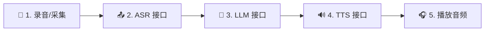

# 3.1 实战一：基于 API 的基础音频对话串联

在语音智能交互的演进过程中，最直观、最易于理解的实现方式莫过于**“基于 API 的同步串联模式”**。本节将带您在 VoxLab 中动手构建这样一个基础对话系统，并探讨其架构的优势与物理局限性。

---

## 1. 业务链路设计

API 串联模式本质上是一个**线性流水线**。我们将人机交互拆分为以下五个依次发生的步骤：



1. **录音与切片**：前端启动麦克风捕获用户语音，并在本地进行 Web VAD（静音检测）判定。一旦判定用户说话结束，将整段音频数据打包成一个二进制文件（如 `recording.webm`）。
2. **ASR 语音转文本**：通过 `HTTP POST` 请求将音频发送至服务端的 `/api/v1/audio/transcriptions`。服务端使用 SenseVoice 或 Vosk 将波形翻译为字符。
3. **LLM 推理问答**：拿到文字后，前端将当前问题连同历史上下文，以 `POST` 方式发送至后端的 `/api/v1/chat/completions`。服务端调用大语言模型（如 DeepSeek-V3），流式回传回答字符。
4. **TTS 语音合成**：LLM 结束输出后，前端将完整的回答文本发往服务端的 `/api/v1/audio/speech`，合成对应的音色音频文件。
5. **音频播放**：前端在拿到生成的音频文件 URL 后，利用浏览器的 Audio 播放源完成播放。

---

## 2. 前端核心编排实现

下面是简化后的前端核心实现代码。它展示了如何用最直观的方式组织各个算法基座的接口：

```javascript
// 基于 API 串联的语音问答控制器
async function handleVoiceInteraction(audioBlob) {
  try {
    setPhase('recognizing'); // 状态: 识别中
    
    // 1. 调用 ASR 将录音转为文本
    const formData = new FormData();
    formData.append('file', audioBlob, 'utterance.webm');
    formData.append('model', 'sensevoice');
    
    const asrResponse = await fetch('/api/v1/audio/transcriptions', {
      method: 'POST',
      body: formData,
    });
    const asrData = await asrResponse.json();
    const userText = asrData.text?.trim();
    if (!userText) {
      setPhase('idle');
      return;
    }

    // 2. 将文本喂给 LLM 接口
    setPhase('thinking'); // 状态: 思考中
    const chatResponse = await fetch('/api/v1/chat/completions', {
      method: 'POST',
      headers: { 'Content-Type': 'application/json' },
      body: JSON.stringify({
        messages: [{ role: 'user', content: userText }],
        stream: false // 此处采用非流式以便进行下一步合成
      }),
    });
    const chatData = await chatResponse.json();
    const replyText = chatData.choices[0].message.content;

    // 3. 调用 TTS 生成发音文件
    setPhase('speaking'); // 状态: 播报中
    const ttsResponse = await fetch('/api/v1/audio/speech', {
      method: 'POST',
      headers: { 'Content-Type': 'application/json' },
      body: JSON.stringify({
        model: 'kokoro',
        input: replyText,
        voice: 'am_nicole',
        response_format: 'mp3'
      }),
    });
    
    const audioBlobOut = await ttsResponse.blob();
    
    // 4. 浏览器播放生成的音频
    const audioUrl = URL.createObjectURL(audioBlobOut);
    const audio = new Audio(audioUrl);
    audio.onended = () => setPhase('idle');
    audio.play();

  } catch (error) {
    console.error("语音链串联出错", error);
    setPhase('idle');
  }
}
```

---

## 3. 架构优缺点剖析

### 🟢 优势
* **逻辑清晰，极易维护**：各模块职责单一，接口边界极其分明，是初学者理解 AI 语音工作流的最佳实践。
* **网络鲁棒性好**：数据全部通过标准的 HTTP RESTful 协议传输，对断网、网络延迟有天然的包重传保护，不需要维护长连接状态。
* **本地调试便利**：在浏览器的开发者工具中，可以清晰在 Network（网络）中跟踪到每一步请求的载荷与返回值，极其方便定位是 ASR 识别不对还是 LLM 生成出错。

### 🔴 局限性与高时延（Latency）
* **时延叠加**：流程中的每一步都是**同步阻塞**的。ASR 必须等录音传完；LLM 必须等 ASR 跑完；TTS 必须等 LLM 说完整句。这使得整个问答的首包响应延迟（RTF）是所有耗时的总和：
  $$\text{Latency} = T_{\text{ASR}} + T_{\text{LLM}} + T_{\text{TTS}} \approx 2.5\text{s} - 4.5\text{s}$$
* **不适合实时交流**：2秒以上的卡顿对于人机语音对讲来说，是非常糟糕的体验，类似打电话时断时续。

为了解决这个物理限制，我们在下一节将介绍并实战构建**“工业级低时延 WebSocket 双向流式通话”**。
