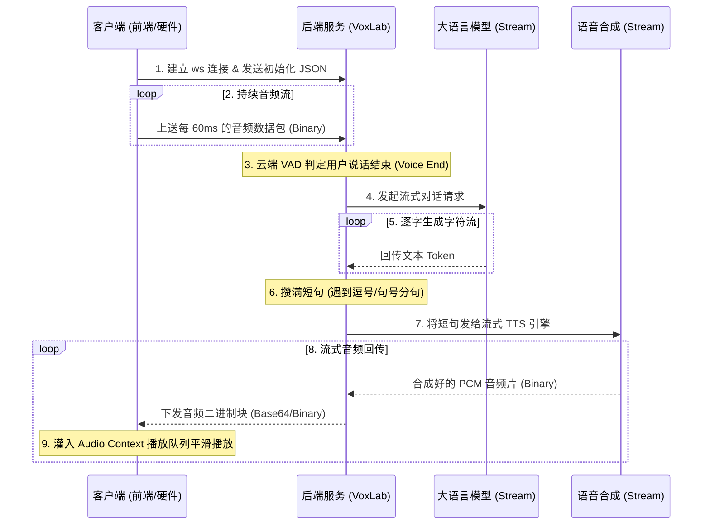

# 3.2 实战二：构建工业级低延迟双向流式对话

在真正的商业级语音智能体（如 OpenAI Voice Mode 或端侧智能硬件对讲）中，为了达到低于 **1 秒** 的极致自然对话时延，系统无一例外会抛弃单调的 HTTP 轮询编排，升级为基于 **WebSocket 双向全双工流式级联** 的底层架构。

本节将为您深入剖析并实战构建这一套工业级实时流式对讲的内部奥秘。

---

## 1. 流式级联架构设计 (Streaming Cascade)

不同于 HTTP 串联模式的“各行其是”，流式级联让 ASR、LLM 和 TTS 的工作在时间线上**高度重叠 (Pipelined)**。其核心秘密在于：**不需要等待整句话说完，而是一旦有局部的结果，立刻送往下一个环节。**



### 🏆 极致低延迟的秘诀
1. **云端协同 VAD**：硬件/前端不负责长时判定，只管不停上送音频包。服务端的神经网络 VAD 在云端以极快的速度在数据包中判定 `Voice End`。
2. **文本分句触发 (Sentence Splitting)**：服务端拿到 LLM 流式输出的字符时，采用简易的分句算法（遇到 `,`、`。`、`?` 等标点）。一旦凑齐一句话，不等 LLM 输出完，立刻开始调 TTS 生成这句的声音。
3. **音频流式拼接播放**：前端在接收到下发的多个音频切片时，在底层利用 Web Audio API 维护一个播放序列，前一段快放完时，后一段必须无缝拼上去，从而实现“边生成边播放”的不卡顿体验。

---

## 2. 后端 WebSocket 流式处理器实现

在后端，我们在 `audio.py` 中开辟一条独立的双向通道。整个交互逻辑由协程（Coroutines）控制：

```python
from fastapi import APIRouter, WebSocket, WebSocketDisconnect
import json
import asyncio

router = APIRouter(prefix="/api/v1/audio")

@router.websocket("/agent/ws")
async def voice_agent_websocket(websocket: WebSocket):
    await websocket.accept()
    logger.info("[WS] Voice Agent stream connected")
    
    # 1. 接收初始化 JSON 配置
    init_data = await websocket.receive_json()
    speaker_id = init_data.get("speaker_id", "haruna")
    api_key = init_data.get("selected_key", "")
    
    # 2. 启动异步接收音频包的事件循环
    try:
        while True:
            # 持续接收二进制 PCM/Opus 包
            data = await websocket.receive_bytes()
            
            # [VAD & ASR 实时处理部分]
            # 一旦触发 Voice End，进入 ASR 转写并通知 LLM 
            # (将在下一节的代码实现中详细演示此处的流式状态机)
            
    except WebSocketDisconnect:
        logger.info("[WS] Connection closed")
```

---

## 3. 前端音频队列缓存平滑播放原理 (Audio Queue Buffer)

前端在收到流式的二进制音频（Base64 或 ArrayBuffer）时，如果用多个原生的 `<audio>` 标签交替播放，会在交接处产生明显的**爆音（Pop Noise）**或卡顿。

标准的做法是使用 HTML5 的 **`Web Audio API`**：

```javascript
class AudioPlayerQueue {
  constructor() {
    this.audioCtx = new (window.AudioContext || window.webkitAudioContext)();
    this.nextPlayTime = 0; // 下一个切片应该开始播放的绝对时间
  }

  // 往队列里喂一段解码后的 PCM 二进制数据
  queueAudioChunk(arrayBuffer) {
    this.audioCtx.decodeAudioData(arrayBuffer, (audioBuffer) => {
      const sourceNode = this.audioCtx.createBufferSource();
      sourceNode.buffer = audioBuffer;
      sourceNode.connect(this.audioCtx.destination);

      const currentTime = this.audioCtx.currentTime;
      // 如果播放指针已经落后于当前时间，直接从当前开始播
      if (this.nextPlayTime < currentTime) {
        this.nextPlayTime = currentTime;
      }

      // 定时精准预排期播放
      sourceNode.start(this.nextPlayTime);
      
      // 更新下一个切片的起点指针 = 当前起点 + 该音频片段的时长
      this.nextPlayTime += audioBuffer.duration;
    });
  }
}
```

通过这种精准时间轴的排期（`sourceNode.start(nextPlayTime)`），多个小音频切片就可以在声卡输出端实现**零间隙（Gapless）**的平滑过渡，让用户听起来就像是在收听一个连贯的长段声音，完美解决了流式语音下发的技术难题。
